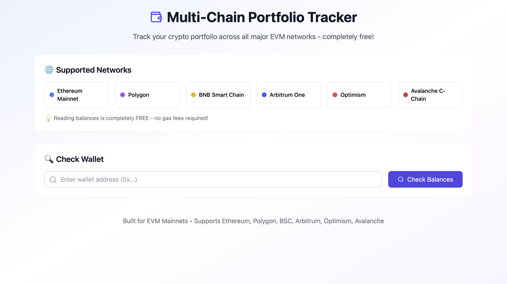
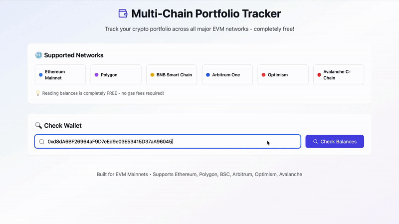

# Multi-Chain Portfolio Tracker

Track your cryptocurrency portfolio across multiple EVM-compatible blockchains in real-time. This application allows you to check token balances across Ethereum, Polygon, BNB Smart Chain, Arbitrum, Optimism, and Avalanche networks.

[](https://multi-chain-token-checker.vyommodi-3.workers.dev)



## 🚀 Features

- **Multi-Chain Support**: Check balances across 6 major EVM networks
- **Real-Time Data**: Fetch live balance data directly from blockchain RPC endpoints
- **Popular Tokens**: Pre-configured with popular ERC-20 tokens on each network
- **Free to Use**: No API keys required - uses public RPC endpoints
- **Responsive Design**: Works on desktop and mobile devices
- **Copy Token Addresses**: Easily copy token contract addresses
- **Explorer Integration**: Direct links to blockchain explorers

## 🌐 Supported Networks

- **Ethereum Mainnet** - ETH, USDC, USDT, WBTC, UNI
- **Polygon** - MATIC, USDC, USDT, WETH, WBTC
- **BNB Smart Chain** - BNB, USDT, USDC, BUSD, CAKE
- **Arbitrum One** - ETH, USDC, USDT, WBTC, ARB
- **Optimism** - ETH, USDC, USDT, WBTC, OP
- **Avalanche C-Chain** - AVAX, USDC, USDT, WBTC, WAVAX

## 🛠️ Installation

```bash
# Clone the repository:
git clone https://github.com/vyom-modi/multi-chain-token-checker.git
cd multi-chain-token-checker

# Install dependencies:
npm install

# Start the development server:
npm start

# Open http://localhost:3000 in your browser
```

## 📖 Usage



1. Enter a valid Ethereum wallet address (0x...)
2. Click "Check Balances" to fetch data from all networks
3. View native token balances and ERC-20 token balances
4. Click the external link icon to view the address on the blockchain explorer
5. Click the copy icon next to token symbols to copy contract addresses

## 🔧 Configuration

### Adding New Networks
Edit `src/config/networks.js` to add new EVM-compatible networks:

```javascript
newNetwork: {
  name: 'Network Name',
  rpcUrl: 'https://rpc-url.com',
  chainId: 123,
  symbol: 'SYMBOL',
  explorer: 'https://explorer.com',
  color: 'bg-color-class'
}
```

### Adding New Tokens
Edit `src/config/tokens.js` to add tokens for specific networks:

```javascript
networkKey: [
  { symbol: 'TOKEN', address: '0x...', decimals: 18 }
]
```

## 🏗️ Project Structure

```
.
├── docs/               # Documentation and media files
│   └── media/          # Screenshots and demo GIFs
├── src/                # Source code
│   ├── components/     # React components
│   │   ├── Header.js       # App header
│   │   ├── NetworkInfo.js  # Network information display
│   │   ├── WalletSearch.js # Wallet address input
│   │   ├── BalanceDisplay.js # Balance results display
│   │   └── Footer.js       # App footer
│   ├── config/         # Configuration files
│   │   ├── networks.js     # Network configurations
│   │   └── tokens.js       # Token configurations
│   ├── utils/          # Utility functions
│   │   ├── blockchain.js   # Blockchain interaction functions
│   │   └── formatters.js   # Data formatting utilities
│   ├── App.js          # Main app component
│   └── index.js        # App entry point
├── public/             # Static files
└── package.json        # Project dependencies and scripts
```

## 🔒 Security & Privacy

- **No Private Keys**: This app only reads public blockchain data
- **No Data Storage**: No wallet addresses or balances are stored
- **Client-Side Only**: All processing happens in your browser
- **Open Source**: Code is publicly available for review

## 🌍 RPC Endpoints

This application uses public RPC endpoints:

- **Ethereum**: LlamaRPC
- **Polygon**: Official Polygon RPC
- **BSC**: Binance public RPC
- **Arbitrum**: Official Arbitrum RPC
- **Optimism**: Official Optimism RPC
- **Avalanche**: Official Avalanche RPC

## 📝 License

[MIT License](LICENSE) - see the [LICENSE](LICENSE) file for details

## 🤝 Contributing

1. Fork the repository
2. Create a feature branch
3. Make your changes
4. Add tests if applicable
5. Submit a pull request

## ⚠️ Disclaimer

This tool is for informational purposes only. Always verify balances on official blockchain explorers. The developers are not responsible for any decisions made based on the information provided by this application.
